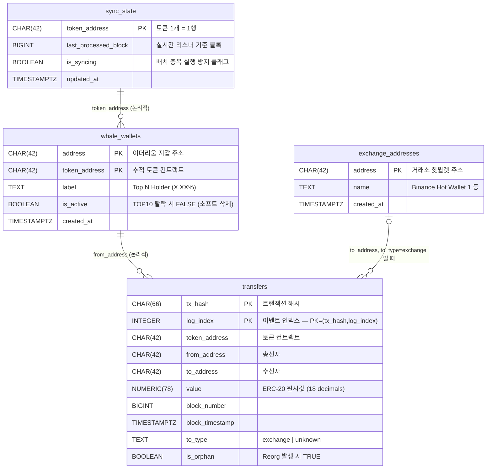
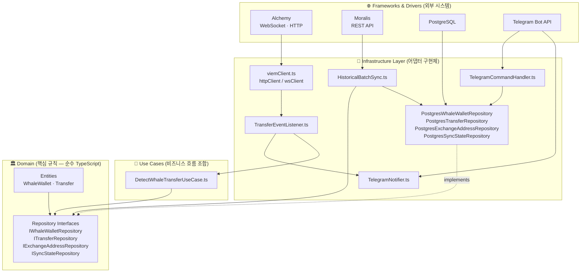
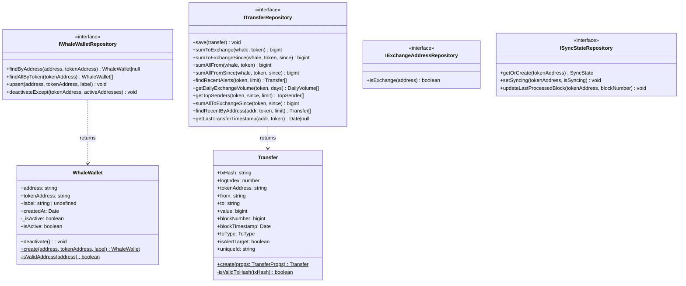
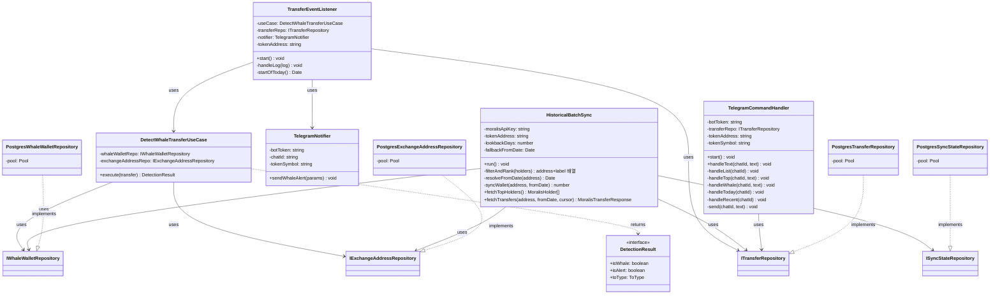
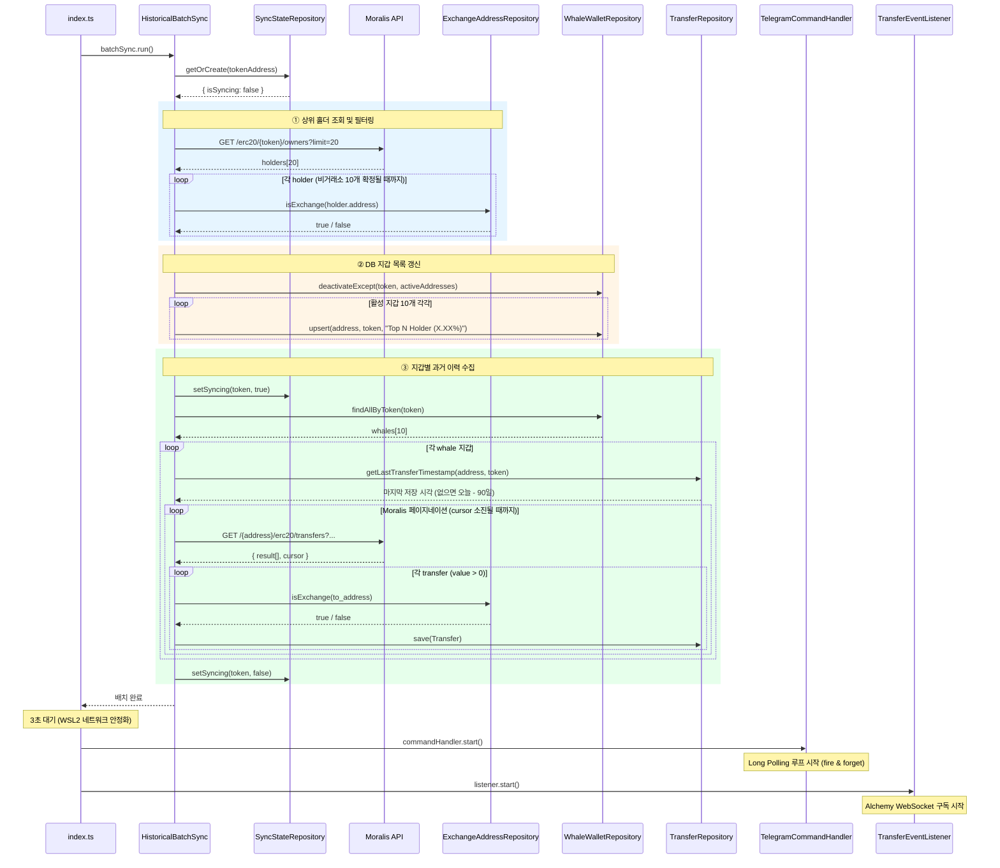
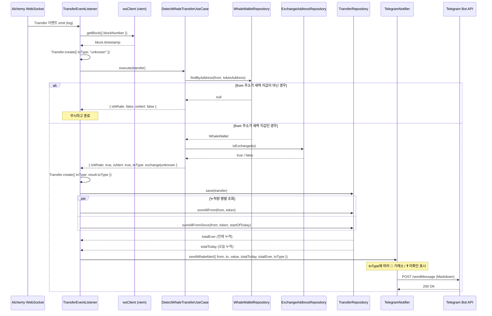
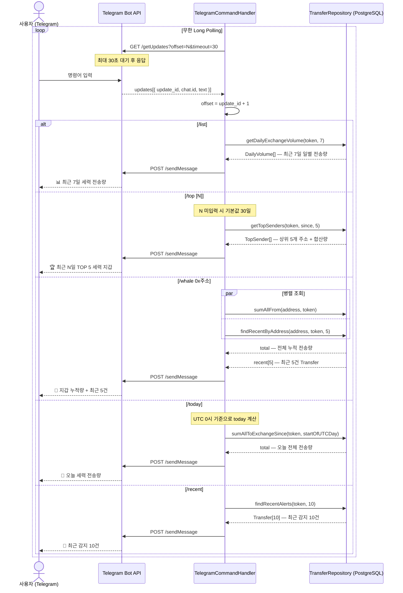

# bv_indexer 시스템 다이어그램

**프로젝트**: 세력 지갑 트래커
**목적**: 특정 ERC-20 토큰의 상위 홀더(세력 지갑) 온체인 출금을 실시간 감지하고 Telegram으로 알림

---

## 목차

1. [데이터베이스 ERD](#1-데이터베이스-erd)
2. [Clean Architecture 레이어 구조](#2-clean-architecture-레이어-구조)
3. [클래스 다이어그램](#3-클래스-다이어그램)
4. [시퀀스 — 애플리케이션 시작 흐름](#4-시퀀스--애플리케이션-시작-흐름)
5. [시퀀스 — 실시간 Transfer 감지](#5-시퀀스--실시간-transfer-감지)
6. [시퀀스 — Telegram 명령어 처리](#6-시퀀스--telegram-명령어-처리)

---

## 1. 데이터베이스 ERD

테이블 4개로 구성. **FK 제약은 없으며** 모든 관계는 애플리케이션 레벨에서 처리.

### 주요 설계 결정

| 결정 | 이유 |
|------|------|
| `(tx_hash, log_index)` 복합 PK | 동일 트랜잭션에 여러 Transfer 이벤트 가능. 재처리해도 중복 행 없음 (멱등성) |
| `is_orphan` 플래그 | Reorg 발생 시 행을 DELETE하지 않고 플래그만 변경 → 히스토리 보존 |
| `is_active` 소프트 삭제 | TOP10에서 빠진 지갑을 삭제하지 않음 → 과거 이력 유지 |
| `to_type` 컬럼 | 거래소 여부를 저장 시점에 판정해 두면 조회 시 JOIN 불필요 |
| FK 없음 | 인덱서 특성상 배치 INSERT 성능이 핵심. 참조 무결성은 앱 레벨에서 보장 |

---

## 2. Clean Architecture 레이어 구조

의존성은 항상 **바깥(Frameworks) → 안쪽(Domain)** 방향으로만 흐른다.
Domain 레이어는 어떤 외부 라이브러리에도 의존하지 않는다.

---

## 3. 클래스 다이어그램

### 3-1. Domain 레이어 — Entities & Repository Interfaces

### 3-2. Use Cases & Infrastructure 레이어

---

## 4. 시퀀스 — 애플리케이션 시작 흐름

`npm start` 실행 시 **배치 → TG 폴링 → 실시간 리스너** 순으로 시작된다.

---

## 5. 시퀀스 — 실시간 Transfer 감지

Alchemy WebSocket에서 이벤트가 도착할 때마다 실행된다.

---

## 6. 시퀀스 — Telegram 명령어 처리

`commandHandler.start()` 이후 무한 루프로 실행된다.
Long Polling (`timeout=30`)으로 새 메시지를 대기한다.

---

## 참고 — 환경변수 목록

| 변수 | 필수 | 설명 |
|------|------|------|
| `TOKEN_ADDRESS` | ✅ | 추적할 ERC-20 토큰 컨트랙트 주소 |
| `TOKEN_SYMBOL` | ✅ | 토큰 심볼 (Telegram 메시지에 표시) |
| `ALCHEMY_API_KEY` | ✅ | Alchemy WebSocket/HTTP 키 |
| `MORALIS_API_KEY` | ✅ | Moralis REST API 키 |
| `TG_BOT_KEY` | ✅ | BotFather에서 발급한 봇 토큰 |
| `TG_CHAT_ID` | ✅ | 알림 수신 채팅방 ID |
| `DB_HOST` | ✅ | PostgreSQL 호스트 |
| `DB_PORT` | ✅ | PostgreSQL 포트 |
| `DB_NAME` | ✅ | DB 이름 |
| `DB_USER` | ✅ | DB 사용자 |
| `DB_PASSWORD` | ✅ | DB 비밀번호 |
| `BATCH_LOOKBACK_DAYS` | ❌ | 배치 조회 기간 (기본값: 90일) |
